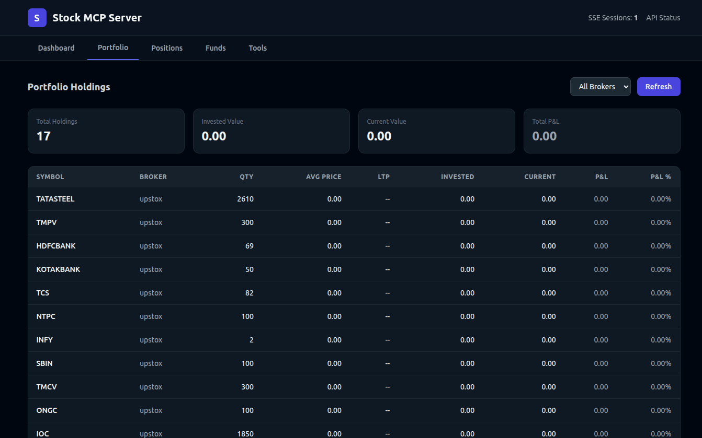

<div align="center">

# Stock MCP Server

### AI-Powered Indian Stock Market Analysis

[](https://modelcontextprotocol.io)
[](https://www.typescriptlang.org)
[](https://expressjs.com)
[](LICENSE)

Connect **Upstox** & **Rupeezy** broker accounts to **Claude Code** and **Cursor** for real-time portfolio insights.


[Getting Started](#-quick-start) · [MCP Prompts](#-mcp-prompt-examples) · [Tools](#-tools) · [Dashboard](#-dashboard)

</div>

---

## What It Does

```
Your Broker Accounts  ──►  Stock MCP Server  ──►  Claude / Cursor AI
    (Upstox, Rupeezy)        (Express + SSE)       (Portfolio Analysis)
```

An MCP server that bridges Indian stock broker APIs with AI assistants. Authorize your brokers via browser OAuth, then ask Claude or Cursor to analyze your portfolio, track positions, check funds, and fetch market data — all through natural language.

---

## Features

| | Feature | Description |
|---|---|---|
| **Multi-Broker** | Upstox + Rupeezy | Unified data format across brokers |
| **OAuth Built-in** | Browser-based login | No manual token copying |
| **6 MCP Tools** | Portfolio, positions, quotes, history, funds, analysis | Full market data access |
| **AI Analysis** | P&L, diversification, concentration risk | Smart portfolio insights |
| **Web Dashboard** | Tailwind dark theme | Broker auth, data views, tool testing |
| **SSE Transport** | Express server | Works with Claude Code & Cursor |

---

## Tools

| Tool | Description |
|:-----|:------------|
| `get_portfolio` | Fetch long-term holdings from Upstox / Rupeezy / both |
| `get_positions` | Fetch current open intraday & delivery positions |
| `get_stock_quote` | Real-time stock quote — LTP, OHLC, volume, change% |
| `get_historical_data` | Historical OHLCV candle data (1min to monthly) |
| `analyze_portfolio` | P&L summary, top gainers/losers, diversification score, concentration risk |
| `get_funds` | Account balance, available margin, used margin, collateral |

---

## Quick Start

### 1. Install & Build

```bash
pnpm install
pnpm build
```

### 2. Configure Environment

```bash
cp .env.example .env
```

Add your broker API credentials (access tokens are obtained via OAuth automatically):

```env
PORT=3001

# Upstox (https://account.upstox.com/developer/apps)
UPSTOX_API_KEY=your_client_id
UPSTOX_API_SECRET=your_client_secret

# Rupeezy (https://vortex.rupeezy.in/login)
RUPEEZY_APPLICATION_ID=your_app_id
RUPEEZY_API_SECRET=your_api_secret
```

### 3. Start the Server

```bash
node dist/index.js
# or dev mode with auto-reload
pnpm dev
```

### 4. Authorize Brokers

Open **http://localhost:3001** in your browser. Click **Connect Upstox** or **Connect Rupeezy** to authorize via OAuth.

### 5. Connect AI Client

Add to your Claude Code or Cursor MCP config:

```json
{
  "mcpServers": {
    "stock-mcp": {
      "command": "npx",
      "args": ["mcp-remote", "http://localhost:3001/sse"]
    }
  }
}
```

---

## MCP Prompt Examples

Once connected, try these prompts in **Claude Code** or **Cursor**:

### Portfolio & Holdings

```
> Show all my stock holdings across brokers

> Which stocks am I holding in Upstox?

> What's my total invested value and current portfolio value?

> List my top 5 holdings by current value
```

### Portfolio Analysis

```
> Analyze my portfolio — show P&L, top gainers, top losers

> What's my portfolio diversification score? Am I too concentrated in any stock?

> Which stocks are dragging my portfolio down the most?

> Compare my Upstox vs Rupeezy portfolio performance
```

### Positions (Intraday/Trades)

```
> Do I have any open positions today?

> Show my intraday positions and their P&L

> What's my total day P&L across all brokers?
```

### Market Data & Quotes

```
> What's the current price of Reliance? (instrument: NSE_EQ|INE002A01018)

> Get me a real-time quote for TCS including volume and day change

> Show OHLC data for Infosys today
```

### Historical Data

```
> Show me daily candle data for HDFC Bank for the last 30 days

> Get weekly historical data for Nifty 50 from Jan to March 2025

> Fetch 15-minute candles for Reliance for yesterday
```

### Funds & Account

```
> How much available margin do I have?

> Show my account balance and collateral across all brokers

> What's my total fund balance in Upstox?
```

### Multi-Step Analysis

```
> Fetch my portfolio, then analyze which sectors I'm overweight in
  based on the stocks I hold

> Get my holdings and current prices, then calculate which stocks
  have fallen more than 10% from my buy price

> Show my portfolio analysis and suggest which positions I might
  consider rebalancing for better diversification
```

---

## Dashboard

The web dashboard at `http://localhost:3001` provides:

| Tab | Description |
|:----|:------------|
| **Dashboard** | Broker connection status, OAuth login buttons, MCP client config |
| **Portfolio** | Holdings table with P&L, summary cards (invested, current, P&L) |
| **Positions** | Open positions table with day P&L tracking |
| **Funds** | Account margin, balance, collateral per broker |
| **Tools** | Interactive tool testing with JSON response viewer |

---

## Auth Flow

```
┌─────────────┐    ┌──────────────┐    ┌──────────────┐
│   Browser    │───►│  MCP Server  │───►│ Broker OAuth │
│  localhost   │◄───│  :3001       │◄───│ Upstox/Rupzy │
└─────────────┘    └──────┬───────┘    └──────────────┘
                          │
                   ┌──────▼───────┐
                   │ Claude/Cursor│
                   │  (MCP SSE)   │
                   └──────────────┘
```

1. Start server → Open `http://localhost:3001`
2. Click **Connect Upstox** → Login at Upstox → Redirected back → Broker active
3. Click **Connect Rupeezy** → Login at Rupeezy → Redirected back → Broker active
4. AI client connects via `npx mcp-remote http://localhost:3001/sse`

> **Note:** Upstox tokens expire at 3:30 AM daily. Re-authorize via the dashboard each morning.
> You can also set `UPSTOX_ACCESS_TOKEN` / `RUPEEZY_ACCESS_TOKEN` in `.env` as fallback.

---

## API Endpoints

| Endpoint | Method | Description |
|:---------|:------:|:------------|
| `/` | GET | Web dashboard |
| `/sse` | GET | MCP SSE stream |
| `/messages` | POST | MCP message handler |
| `/auth/upstox` | GET | Start Upstox OAuth |
| `/auth/upstox/callback` | GET | Upstox OAuth callback |
| `/auth/rupeezy` | GET | Start Rupeezy OAuth |
| `/auth/rupeezy/callback` | GET | Rupeezy OAuth callback |
| `/auth/status` | GET | Broker connection status (JSON) |
| `/api/portfolio` | GET | Portfolio holdings |
| `/api/positions` | GET | Open positions |
| `/api/funds` | GET | Account funds |
| `/api/analysis` | GET | Portfolio analysis |
| `/api/quote` | GET | Stock quote |
| `/api/history` | GET | Historical candle data |

---

## Instrument Key Formats

| Broker | Format | Example (Reliance) |
|:-------|:-------|:-------------------|
| Upstox | `{EXCHANGE}_{SEGMENT}\|{ISIN}` | `NSE_EQ\|INE002A01018` |
| Rupeezy | `{EXCHANGE}_{SEGMENT}-{TOKEN}` | `NSE_EQ-2885` |

---

## Project Structure

```
src/
├── index.ts                    # Entry point — starts Express server
├── server.ts                   # Express app with SSE + OAuth + REST API
├── config.ts                   # Environment config loader
├── types/                      # Unified type definitions
│   ├── portfolio.ts            #   Holding, Position
│   ├── market.ts               #   StockQuote, OHLCVCandle
│   ├── funds.ts                #   FundsInfo
│   └── common.ts               #   BrokerSource
├── brokers/
│   ├── broker.interface.ts     # IBroker contract
│   ├── upstox/
│   │   ├── client.ts           #   Upstox adapter (upstox-js-sdk)
│   │   ├── mapper.ts           #   Response mappers
│   │   └── auth.ts             #   OAuth helpers
│   └── rupeezy/
│       ├── client.ts           #   Rupeezy adapter (@rupeezy/jsvortex)
│       ├── mapper.ts           #   Response mappers
│       └── auth.ts             #   OAuth helpers
├── services/                   # Business logic layer
│   ├── portfolio.service.ts    #   Holdings & positions aggregation
│   ├── market.service.ts       #   Quotes & historical data
│   ├── funds.service.ts        #   Account balance & margin
│   └── analysis.service.ts     #   P&L, diversification, risk
├── views/                      # Dashboard view components
│   ├── index.ts                #   Composes all views
│   ├── layout.ts               #   HTML shell, header, nav, footer
│   ├── dashboard.view.ts       #   Broker cards + MCP config
│   ├── portfolio.view.ts       #   Holdings table
│   ├── positions.view.ts       #   Positions table
│   ├── funds.view.ts           #   Funds cards
│   ├── tools.view.ts           #   Tool testing UI
│   └── scripts.ts              #   Client-side JavaScript
├── tools/                      # MCP tool definitions
└── utils/                      # Logger, cache, rate limiter
```

---

## Tech Stack

| | Technology | Purpose |
|---|---|---|
| | **TypeScript + ESM** | Type-safe, modern JS |
| | **Express** | HTTP server + SSE transport |
| | **@modelcontextprotocol/sdk** | MCP server framework |
| | **upstox-js-sdk** | Upstox API client |
| | **@rupeezy/jsvortex** | Rupeezy API client |
| | **Zod** | Schema validation |
| | **Tailwind CSS** | Dashboard styling (CDN) |

---

<div align="center">

**Built for AI-powered stock analysis**

[Report Issue](../../issues) · [Request Feature](../../issues)

</div>
